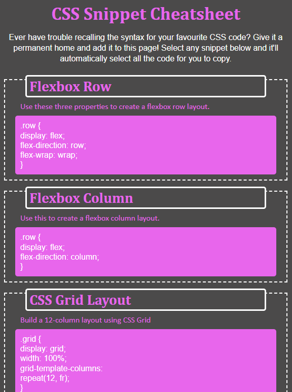
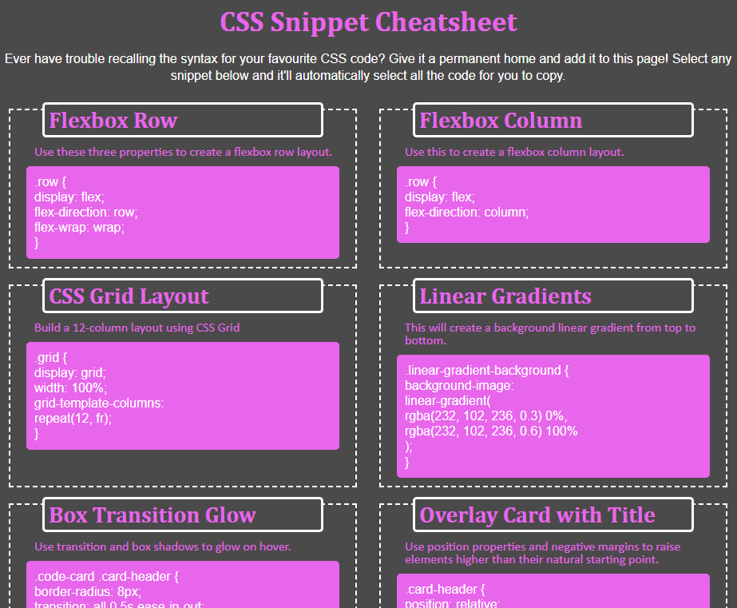
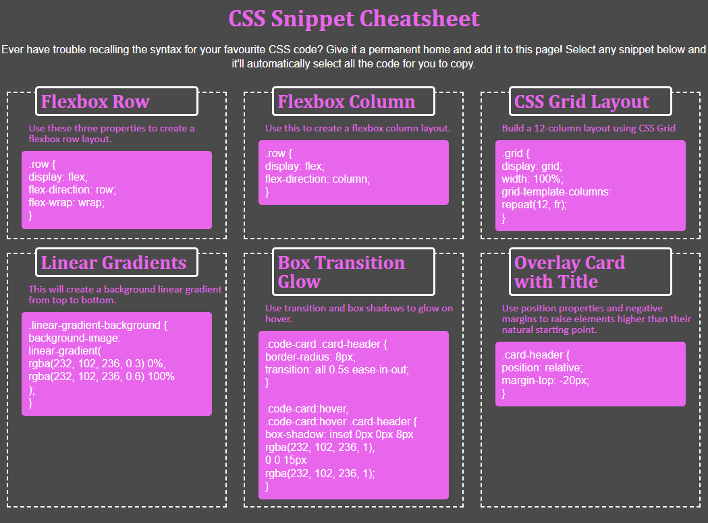

# Title: CSS Code Snippet Cheatsheet

# Project Links
Deployed Link: https://nrprabhav.github.io/module-1-challenge/

Repository Link: https://github.com/nrprabhav/module-1-challenge

# Description
The aim of the work was to make a CSS cheatsheet from which code snippets could be copied. The page was to be responsive to the screen size and should use flex boxes for the functionality.

# Idea
The idea is to have each of the cards as an element which can be put into a flex container. The flex elements are then arranged in the container column-wise with a wrap.

As the screen-width changes, the width of the elements (as a percentage of the screen width) is changed. This enable one, two or three elements to appear in each row. The percentage was determined by trial and error though it is possible to calculate it as well.

# Screenshot
The following is the look of the page when the width is less than 768px:

When the width is greater than 768px but less than 992px, the page look like:

When the width is greater than 992px, the page looks like:

